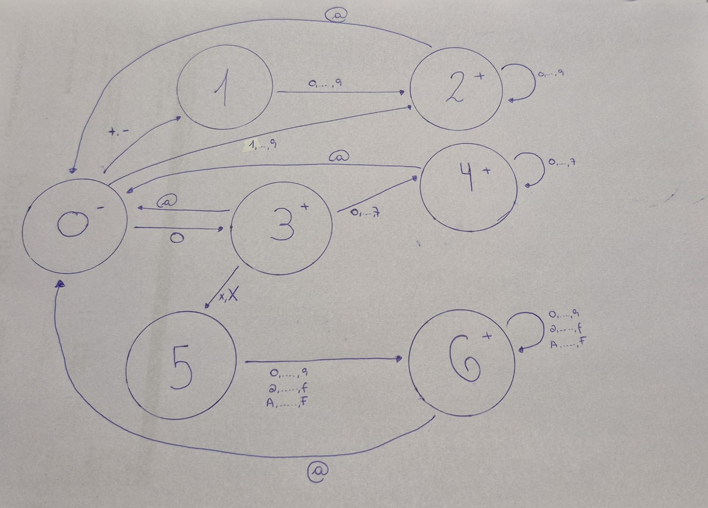
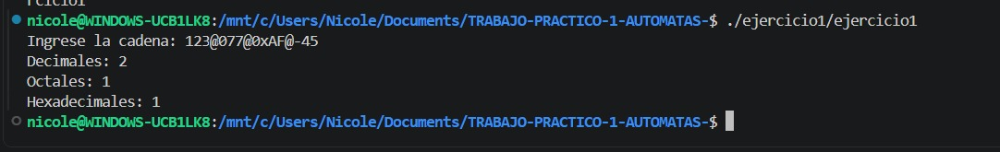
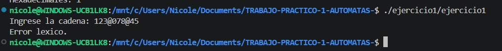
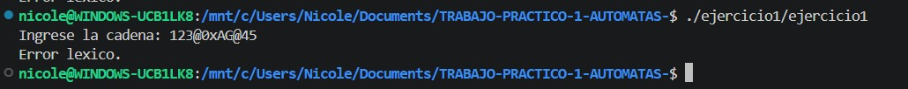
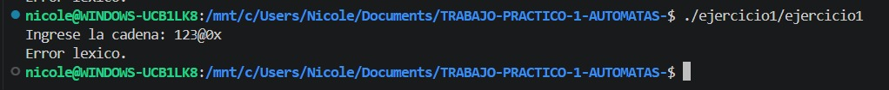
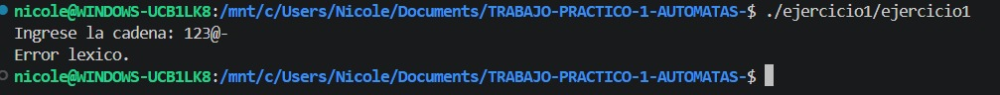
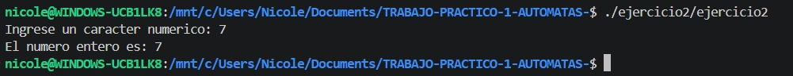
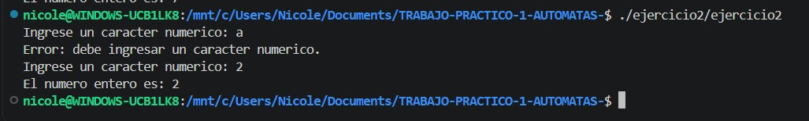

# Trabajo Práctico 1 - Autómatas

 Integrantes : Nicole Brunstein
 Curso : K2002
 Docente : Ing.Roxana Leituz

## Ejercicio 1 - [`ejercicio1/ejercicio1.c`](../ejercicio1/ejercicio1.c)

### Decisiones tomadas
Para la resolución de este ejercicio del TP tuvimos que tomar ciertas decisiones sobre algunos casos que no estaban especificados en la consigna. A continuación, listamos las decisiones tomadas:

- Notación octal: decidimos representar los octales con un 0 inicial y al menos un dígito más entre 0 y 7.
Ej.: 07, 012, 077.
- Notación hexadecimal: decidimos usar el prefijo 0x o 0X.
Ej.: 0xAF, 0X25.
- El 0 solo: decidimos considerarlo decimal y no octal.
- Letras hexadecimales: decidimos aceptar tanto mayúsculas como minúsculas: A..F y a..f.
- 08 y 09: como un número que comienza con 0 intenta reconocerse como octal, decidimos que estos casos sean considerados error léxico, en lugar de interpretarlos como decimales.
- 0x sin dígitos posteriores: decidimos que sea inválido. Después de 0x o 0X debe aparecer al menos un dígito hexadecimal.
- Separador final: decidimos que una cadena como 12@07@ sea inválida, ya que interpretamos @ como separador entre dos constantes y, por lo tanto, después de él debe comenzar otra.

### Implementación

Para implementar el autómata se utilizó una variable `estado`, que indica el estado actual durante el recorrido de la cadena.

La cadena se recorre carácter por carácter. Según el estado actual y el carácter leído, se cambia al estado correspondiente siguiendo la tabla de transiciones.

Cuando se encuentra el separador `@`, se contabiliza la constante reconocida y se vuelve al estado inicial para analizar la siguiente.

Si no existe una transición válida para el carácter leído, se informa un error léxico.

Al finalizar la cadena se verifica que el autómata haya quedado en un estado final y se contabiliza la última constante.

### Autómata


### Definición formal
El autómata se define formalmente como:

**M = (Q, Σ, δ, q0, F)**

Donde:

- **Q = {q0, q1, q2, q3, q4, q5, q6}**
  es el conjunto de estados.

- **Σ = {0..9, a..f, A..F, x, X, +, -, @}**
  es el alfabeto utilizado.

- **δ**
  es la función de transición, definida en la tabla de transiciones presentada a continuación.

- **q0**
  es el estado inicial.

- **F = {q2, q3, q4, q6}**
  es el conjunto de estados finales.

### Tabla de transiciones

| Estado actual | Entrada | Estado siguiente |
|---|---|---|
| q0 | `+`, `-` | q1 |
| q0 | `1..9` | q2 |
| q0 | `0` | q3 |
| q1 | `0..9` | q2 |
| q2 | `0..9` | q2 |
| q2 | `@` | q0 |
| q3 | `0..7` | q4 |
| q3 | `x`, `X` | q5 |
| q3 | `@` | q0 |
| q4 | `0..7` | q4 |
| q4 | `@` | q0 |
| q5 | `0..9`, `a..f`, `A..F` | q6 |
| q6 | `0..9`, `a..f`, `A..F` | q6 |
| q6 | `@` | q0 |

Cualquier transición que no se encuentre definida en la tabla se considera un error léxico.

### Casos de prueba
Para comprobar el funcionamiento del autómata se probaron cadenas válidas e inválidas.

| Entrada | Resultado esperado | Motivo |
|---|---|---|
| `123@077@0xAF@-45` | 2 decimales, 1 octal, 1 hexadecimal | Cadena válida con los tres tipos |
| `0@07@0xA@+80` | 2 decimales, 1 octal, 1 hexadecimal | Verifica el `0` decimal y el signo `+` |
| `+8@012@0X25` | 1 decimal, 1 octal, 1 hexadecimal | Verifica hexadecimal con `X` mayúscula |
| `123@078@45` | Error léxico | `8` no es un dígito octal |
| `123@0xAG@45` | Error léxico | `G` no pertenece a los dígitos hexadecimales |
| `123@-@45` | Error léxico | Después del signo debe aparecer un dígito |
| `123@0x` | Error léxico | Falta un dígito hexadecimal después de `0x` |
| `12@07@` | Error léxico | La cadena termina con un separador |

### Capturas de las pruebas










## Ejercicio 2 - [`ejercicio2/ejercicio2.c`](../ejercicio2/ejercicio2.c)

### Implementación

Para realizar la conversión se creó la siguiente función:

```c
int caracterAEntero(char c) {
    return c - '0';
}
```

En C, un carácter numérico como '7' no es lo mismo que el número entero 7.

Los caracteres numéricos se encuentran ordenados de forma consecutiva (en el código ASCII). Por este motivo, al restar el carácter '0' se obtiene el valor entero correspondiente.

Por ejemplo:

'7' - '0' = 7

De esta manera se puede convertir cualquier carácter comprendido entre '0' y '9' a su correspondiente número entero.

### Validación de la entrada

Antes de realizar la conversión verificamos que el carácter ingresado se encuentre entre `'0'` y `'9'`.

Para esto utilizamos la siguiente condición:

```c
caracter < '0' || caracter > '9'
```

Si la condición se cumple significa que el carácter ingresado no es numérico.

Mediante un while se vuelve a solicitar un carácter hasta que el usuario ingrese uno válido:
```c
while (caracter < '0' || caracter > '9') {
    printf("Error: debe ingresar un caracter numerico.\n");
    printf("Ingrese un caracter numerico: ");
    scanf(" %c", &caracter);
}
```
Una vez que el carácter es válido, se llama a la función caracterAEntero y se muestra el resultado.

### Casos de prueba

Para comprobar el funcionamiento del programa se realizaron pruebas con caracteres válidos e inválidos.

| Entrada | Resultado esperado |
|---|---|
| `7` | El número entero es `7` |
| `0` | El número entero es `0` |
| `9` | El número entero es `9` |
| `a` | Se informa error y se vuelve a pedir el carácter |
| `#` | Se informa error y se vuelve a pedir el carácter |

### Capturas de las pruebas

#### Ingreso válido



#### Ingreso inválido


## Ejercicio 3

...

## Instructivo
