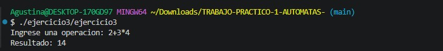
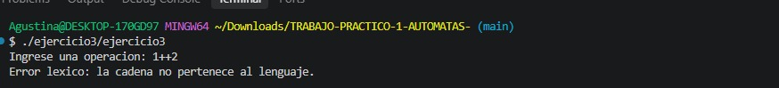
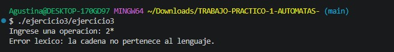
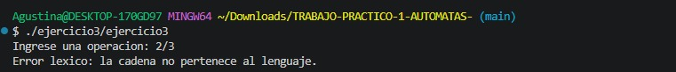

<div align="center">

## TRABAJO PRÁCTICO N.º 1 – AUTÓMATAS

**UNIVERSIDAD TECNOLÓGICA NACIONAL – FRBA**  
Sintaxis y Semántica de los Lenguajes
<br><br>
**Integrantes:** Nicole Brunstein, Ariana Castro, Máximo Colombatto, Federico Dimentstein y Agustina Marques Serra  
**Curso:** K2002  
**Docente:** Ing. Roxana Leituz
</div>

<div class="page"></div>


## Ejercicio 1 - [`ejercicio1/ejercicio1.c`](../ejercicio1/ejercicio1.c)

### Decisiones tomadas
Para la resolución de este ejercicio del TP tuvimos que tomar ciertas decisiones sobre algunos casos que no estaban especificados en la consigna. A continuación, listamos las decisiones tomadas:

- Notación octal: decidimos representar los octales con un 0 inicial y al menos un dígito más entre 0 y 7.
Ej.: 07, 012, 077.
- Notación hexadecimal: decidimos usar el prefijo 0x o 0X.
Ej.: 0xAF, 0X25.
- El 0 solo: decidimos considerarlo decimal y no octal.
- Letras hexadecimales: decidimos aceptar tanto mayúsculas como minúsculas: A..F y a..f.
- 08 y 09: como un número que comienza con 0 intenta reconocerse como octal, decidimos que estos casos sean considerados error léxico, en lugar de interpretarlos como decimales.
- 0x sin dígitos posteriores: decidimos que sea inválido. Después de 0x o 0X debe aparecer al menos un dígito hexadecimal.
- Separador final: decidimos que una cadena como 12@07@ sea inválida, ya que interpretamos @ como separador entre dos constantes y, por lo tanto, después de él debe comenzar otra.
 
### Implementación

Para implementar el autómata se utilizó una variable `estado`, que indica el estado actual durante el recorrido de la cadena.

La cadena se recorre carácter por carácter. Según el estado actual y el carácter leído, se cambia al estado correspondiente siguiendo la tabla de transiciones.

Cuando se encuentra el separador `@`, se contabiliza la constante reconocida y se vuelve al estado inicial para analizar la siguiente.

Si una transición conduce al estado q7, la cadena se considera inválida y se informa un error léxico.

Al finalizar la cadena se verifica que el autómata haya quedado en un estado final y se contabiliza la última constante.

 
### Autómata


 
### Definición formal
El autómata se define formalmente como:

**M = (Q, Σ, δ, q0, F)**

Donde:

- **Q = {q0, q1, q2, q3, q4, q5, q6, q7}**
  es el conjunto de estados.

- **Σ = {0..9, a..f, A..F, x, X, +, -, @}**
  es el alfabeto utilizado.

- **δ**
  es la función de transición, definida en la tabla de transiciones presentada a continuación.

- **q0** es el estado inicial.

- **F = {q2, q3, q4, q6}** es el conjunto de estados finales.

- **q7** estado de rechazo o estado trampa.
 
### Tabla de transiciones

| Estado actual | Entrada | Estado siguiente |
|---|---|---|
| q0 | `+`, `-` | q1 |
| q0 | `1..9` | q2 |
| q0 | `0` | q3 |
| q0 | `x`, `X`, `a..f`, `A..F`, `@` | q7 |
| q1 | `0..9` | q2 |
| q1 | `+`, `-`, `x`, `X`, `a..f`, `A..F`, `@` | q7 |
| q2 | `0..9` | q2 |
| q2 | `@` | q0 |
| q2 | `+`, `-`, `x`, `X`, `a..f`, `A..F` | q7 |
| q3 | `0..7` | q4 |
| q3 | `x`, `X` | q5 |
| q3 | `@` | q0 |
| q3 | `+`, `-`, `8..9`, `a..f`, `A..F` | q7 |
| q4 | `0..7` | q4 |
| q4 | `@` | q0 |
| q4 | `+`, `-`, `8..9`, `x`, `X`, `a..f`, `A..F` | q7 |
| q5 | `0..9`, `a..f`, `A..F` | q6 |
| q5 | `+`, `-`, `x`, `X`, `@` | q7 |
| q6 | `0..9`, `a..f`, `A..F` | q6 |
| q6 | `@` | q0 |
| q6 | `+`, `-`, `x`, `X` | q7 |
| q7 | Cualquier símbolo | q7 |

 
### Casos de prueba
Para comprobar el funcionamiento del autómata se probaron cadenas válidas e inválidas.

| Entrada | Resultado esperado | Motivo |
|---|---|---|
| `123@077@0xAF@-45` | 2 decimales, 1 octal, 1 hexadecimal | Cadena válida con los tres tipos |
| `0@07@0xA@+80` | 2 decimales, 1 octal, 1 hexadecimal | Verifica el `0` decimal y el signo `+` |
| `+8@012@0X25` | 1 decimal, 1 octal, 1 hexadecimal | Verifica hexadecimal con `X` mayúscula |
| `123@078@45` | Error léxico | `8` no es un dígito octal |
| `123@0xAG@45` | Error léxico | `G` no pertenece a los dígitos hexadecimales |
| `123@-@45` | Error léxico | Después del signo debe aparecer un dígito |
| `123@0x` | Error léxico | Falta un dígito hexadecimal después de `0x` |
| `12@07@` | Error léxico | La cadena termina con un separador |

 
### Capturas de las pruebas


<div class="page"></div>
## Ejercicio 2 - [`ejercicio2/ejercicio2.c`](../ejercicio2/ejercicio2.c)

### Implementación

Para realizar la conversión se creó la siguiente función:

```c
int caracterAEntero(char c) {
    return c - '0';
}
```

En C, un carácter numérico como '7' no es lo mismo que el número entero 7.

Los caracteres numéricos se encuentran ordenados de forma consecutiva (en el código ASCII). Por este motivo, al restar el carácter '0' se obtiene el valor entero correspondiente.

Por ejemplo:

'7' - '0' = 7

De esta manera se puede convertir cualquier carácter comprendido entre '0' y '9' a su correspondiente número entero.

 
### Validación de la entrada

Antes de realizar la conversión verificamos que el carácter ingresado se encuentre entre `'0'` y `'9'`.

Para esto utilizamos la siguiente condición:

```c
caracter < '0' || caracter > '9'
```

Si la condición se cumple significa que el carácter ingresado no es numérico.

Mediante un while se vuelve a solicitar un carácter hasta que el usuario ingrese uno válido:
```c
while (caracter < '0' || caracter > '9') {
    printf("Error: debe ingresar un caracter numerico.\n");
    printf("Ingrese un caracter numerico: ");
    scanf(" %c", &caracter);
}
```
Una vez que el carácter es válido, se llama a la función caracterAEntero y se muestra el resultado.

 
### Casos de prueba

Para comprobar el funcionamiento del programa se realizaron pruebas con caracteres válidos e inválidos.

| Entrada | Resultado esperado |
|---|--- |
| `7` | El número entero es `7` |
| `0` | El número entero es `0` |
| `9` | El número entero es `9` |
| `a` | Se informa error y se vuelve a pedir el carácter |
| `#` | Se informa error y se vuelve a pedir el carácter |

 
### Capturas de las pruebas

#### Ingreso válido


#### Ingreso inválido


<div class="page"></div>
## Ejercicio 3 - [`ejercicio3/ejercicio3.c`](../ejercicio3/ejercicio3.c)

### Decisiones tomadas

Para la resolución del ejercicio se decidió dividir el problema en tres etapas:

1. Verificar que todos los caracteres ingresados pertenezcan al alfabeto permitido.
2. Validar mediante un autómata finito determinista que la cadena represente una operación correctamente formada.
3. Evaluar la expresión respetando la precedencia de los operadores.

Se aceptan únicamente:

- números enteros decimales formados por uno o más dígitos entre `0` y `9`;
- los operadores `+`, `-` y `*`.

La expresión debe comenzar con un número y, después de cada operador, debe aparecer obligatoriamente otro número.

Por lo tanto, se consideran inválidas las expresiones que:

- comiencen con un operador;
- terminen con un operador;
- contengan dos operadores consecutivos;
- contengan caracteres que no pertenezcan al alfabeto definido.

Para realizar la operación se decidió dar mayor precedencia al operador `*` respecto de los operadores `+` y `-`.

 

### Autómata
FALTA SUBIR IMAGEN


El autómata utiliza los siguientes estados:

- `q0`: estado inicial. Se espera el comienzo de un número. Este mismo estado se utiliza luego de reconocer un operador, ya que en ambos casos el símbolo siguiente debe ser obligatoriamente un dígito.
- `q1`: se reconoció al menos un dígito. Desde este estado puede continuar otro dígito o aparecer un operador. Es el único estado de aceptación.
- `q2`: estado de rechazo o estado trampa. Se alcanza cuando aparece una secuencia que no corresponde a una expresión válida.

Una vez alcanzado `q2`, cualquier símbolo posterior mantiene al autómata en dicho estado y la cadena es rechazada.

 

### Definición formal

El autómata utilizado para reconocer las expresiones se define formalmente como:

**M = (Q, Σ, δ, q0, F)**

donde:

- **Q = {q0, q1, q2}** es el conjunto de estados.
- **Σ = {0..9, +, -, *}** es el alfabeto.
- **δ** es la función de transición, definida mediante la tabla de transiciones.
- **q0** es el estado inicial.
- **F = {q1}** es el conjunto de estados finales.
- **q2** es el estado de rechazo o estado trampa.

 

### Tabla de transiciones

| Estado actual | Entrada | Estado siguiente |
|---|---|---|
| q0 | `0..9` | q1 |
| q0 | `+`, `-`, `*` | q2 |
| q1 | `0..9` | q1 |
| q1 | `+`, `-`, `*` | q0 |
| q2 | cualquier símbolo de `Σ` | q2 |

El estado `q1` es el único estado de aceptación, ya que una expresión válida debe finalizar necesariamente con un número.

El estado `q2` representa un estado de rechazo o estado trampa. Toda entrada inválida conduce a este estado y, una vez alcanzado, la cadena no puede volver a ser aceptada.

 

### Implementación

La solución se dividió en distintas funciones, cada una con una responsabilidad específica.

#### Clasificación de caracteres

La función `columna()` clasifica cada carácter de entrada según corresponda a:

- un operador (`+`, `-` o `*`);
- un dígito (`0..9`);
- un carácter no perteneciente al alfabeto.

Esta clasificación permite determinar qué columna de la tabla de transiciones debe utilizarse.

#### Verificación del alfabeto

La función `verifica()` recorre la cadena y comprueba que todos los caracteres pertenezcan al alfabeto definido para el ejercicio.

Si se encuentra un carácter distinto de un dígito o de los operadores permitidos, la expresión se rechaza.

Por ejemplo:

`2/3`

es rechazada porque `/` no pertenece al alfabeto.

#### Validación mediante el autómata

La función `esPalabraLeng()` recorre la expresión carácter por carácter.

Para cada símbolo se obtiene su categoría mediante `columna()` y luego se consulta la tabla de transiciones para obtener el nuevo estado:

`estadoActual = tt[estadoActual][columna(caracter)];`

La expresión es aceptada únicamente si, al finalizar el recorrido, el autómata se encuentra en el estado final `q1`.

De esta manera, expresiones como:

`2+3`

son aceptadas, mientras que:

`2++3`

son rechazadas porque luego de reconocer el primer operador el autómata se encuentra en `q0`, donde se espera obligatoriamente un dígito.

 

### Evaluación de la expresión

Una vez validada la expresión, se realiza la operación matemática.

Para ello se utilizan principalmente las funciones:

- `esOperacion()`: determina si un carácter es uno de los operadores permitidos.
- `procesarOperacion()`: procesa el operador reconocido y actualiza el término y el resultado acumulado.
- `evaluarExpresion()`: recorre la expresión completa y obtiene el resultado final.

 

### Precedencia de operadores

Para respetar la precedencia matemática, las multiplicaciones se resuelven antes de incorporar un término al resultado acumulado.

Se mantienen dos valores principales:

- `terminoActual`: almacena el término que se está calculando;
- `resultadoTotal`: almacena la suma de los términos que ya fueron completados.

Cuando se encuentra el operador `*`, el número siguiente se multiplica por `terminoActual`.

En cambio, cuando se encuentra `+` o `-`, el término que se estaba calculando se agrega a `resultadoTotal` y comienza un nuevo término.

Por ejemplo, para:

`2+3*4`

primero se obtiene:

`3*4 = 12`

y luego:

`2+12 = 14`

De esta forma se respeta la precedencia de la multiplicación sin necesidad de utilizar funciones externas.

 

### Funcionamiento general

El funcionamiento del programa puede resumirse en los siguientes pasos:

1. Se obtiene la expresión a analizar.
2. Se verifica que todos sus caracteres pertenezcan al alfabeto.
3. Se utiliza el autómata para comprobar que la expresión esté correctamente formada.
4. Si la expresión es válida, se evalúa respetando la precedencia de operadores.
5. Finalmente se muestra el resultado obtenido.

Si la expresión contiene un carácter que no pertenece al alfabeto, se informa un error léxico.

Si los caracteres pertenecen al alfabeto pero la expresión no tiene una estructura válida, se informa que la operación está mal formada.

 

### Casos de prueba

| Entrada | Resultado esperado | Motivo |
|---|---|---|
| `3+4*7+3-5` | `29` | Se respeta la precedencia de `*` |
| `2+3*4` | `14` | Se realiza primero `3*4` |
| `2*3+4` | `10` | Se realiza primero `2*3` |
| `10-2*3` | `4` | Se realiza primero la multiplicación |
| `2*3*4+5` | `29` | Se permiten multiplicaciones consecutivas |
| `123` | `123` | Una expresión formada por un único número es válida |
| `1++2` | Error | No se permiten operadores consecutivos |
| `2*` | Error | La expresión no puede terminar con un operador |
| `*2` | Error | La expresión no puede comenzar con un operador |
| `2/3` | Error léxico | `/` no pertenece al alfabeto |
| `2+a` | Error léxico | `a` no pertenece al alfabeto |
| `2 + 3` | Error léxico | El espacio no pertenece al alfabeto |

 

### Capturas de las pruebas
> **PENDIENTE:** Cambiar las capturas del ejercicio 3 porque el código anterior muestra como "error léxico" casos que en realidad corresponden a una expresión mal formada. Diferenciar errores léxicos de errores sintácticos/estructurales.
> 
**Expresión válida**



**Error por operadores consecutivos**



**Error por operador al final**



**Error por carácter no válido**




